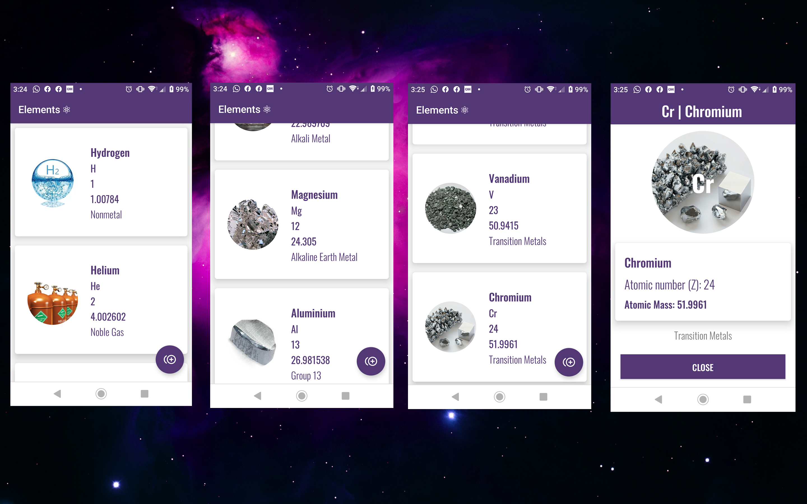

## AIchemy: Conspectus
<p align="justify">
AIchemy is a chemistry resource/utility app built using the MVVM (Model-View-ViewModel) design approach and repository pattern for clean separation of the respective application layers for easy modification, extensibility and testing.<br><br>
The app uses an ElementBuilder class to generate an instance of the periodic table of elements (new ArrayList<PeriodicTable>) with the relevant physical properties data required for a myriad of chemistry analysis/composition based application feature objectives.
From the repository layer, Generated Periodic Elements ArrayList<PeriodicTable> is then iterated to be made available for Element data consumption and a wide range of educational chem applications.
</p>

### ToDo's::improvements() #
``````````````
>> Create Search Interface for easy UX when sorting/filtering through returned Elements list

>> Add Tabs UI component to implement additional app features/functionality

>> Add Pagination feature to Periodic Elements RecyclerView

>> Implement educational Chemistry analysis & composition based on knowledge
garnered from high school chemistry refresher

>> Implement a JSON Object generator with HTTP POST functionality
for prompt 'Periodic Table' webservice data entry

>> Integrate TensorFlow ML feature/functionality

``````````````

<br><br>

&nbsp;

&nbsp;